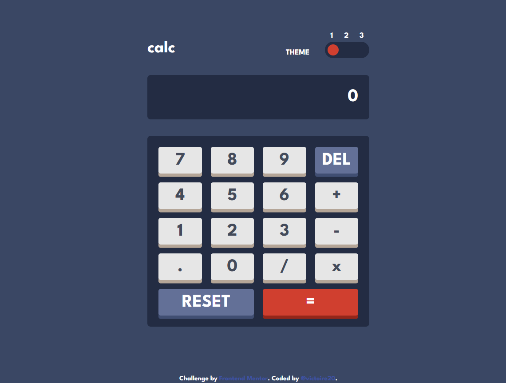
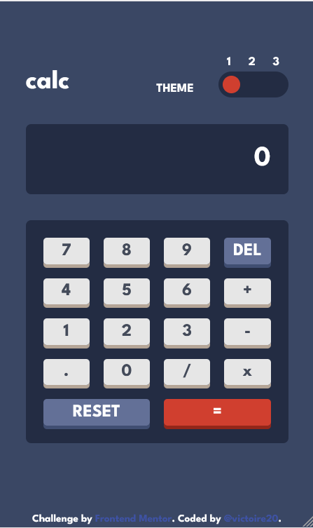

# Frontend Mentor - Calculator app solution

This is a solution to the [Calculator app challenge on Frontend Mentor](https://www.frontendmentor.io/challenges/calculator-app-9lteq5N29). Frontend Mentor challenges help you improve your coding skills by building realistic projects. 

## Table of contents

- [Overview](#overview)
  - [The challenge](#the-challenge)
  - [Screenshot](#screenshot)
  - [Links](#links)
- [My process](#my-process)
  - [Built with](#built-with)
  - [What I learned](#what-i-learned)
  - [Continued development](#continued-development)
  - [Useful resources](#useful-resources)
- [Author](#author)


## Overview

### The challenge

Users should be able to:

- See the size of the elements adjust based on their device's screen size
- Perform mathmatical operations like addition, subtraction, multiplication, and division
- Adjust the color theme based on their preference
- **Bonus**: Have their initial theme preference checked using `prefers-color-scheme` and have any additional changes saved in the browser

### Screenshot





### Links

- Solution URL: [Add solution URL here](https://your-solution-url.com)
- Live Site URL: [https://github.com/victoire20/calculator-app](https://github.com/victoire20/calculator-app)

## My process

### Built with

- Semantic HTML5 markup
- Tailwind CSS
- Flexbox
- CSS Grid
- Mobile-first workflow
- [React](https://reactjs.org/) - JS library


### What I learned

In this calculator challenge, I was able to revisit several concepts that we use every day when doing calculations, often without even realizing it.

This project helped me better understand and implement concepts such as:
* handling digits (numbers) in the calculator display
* managing the states of function keys (addition, subtraction, multiplication, division)
* progressively building a mathematical operation based on user input
* managing operator precedence and calculating the result
* managing the display and formatting of numbers
* managing a dynamic theme system with React (localStorage)

This challenge also helped me improve my approach to state management in a React application and structure the code in a way that is more maintainable and scalable.

I also had to figure out how to adjust the digit width to fit the calculator's screen. It wasn't very complicated, but it was still fun.
```js
const displayRef = useRef<HTMLDivElement>(null)
const spanRef = useRef<HTMLSpanElement>(null)

const [fontSize, setFontSize] = useState(32)

useEffect(() => {
  const container = displayRef.current
  const text = spanRef.current

  if (!container || !text) return

  const textContainer = container.clientWidth

  if ((text.scrollWidth + 21) >= (textContainer - 21)) {
    setFontSize(prev => Math.max(prev - 2, 10))
  } else if ((text.scrollWidth + 21 ) <= ((2.3/3) * textContainer)) {
    setFontSize(32)
  }
}, [digitsDisplay])
```

If you want more help with writing markdown, we'd recommend checking out [The Markdown Guide](https://www.markdownguide.org/) to learn more.

### Continued development

I'd love to add more features if my schedule allows it! I'd like to turn it into a more advanced scientific calculator that can solve more complex equations.

### Useful resources

- [TailwindCSS](https://tailwindcss.com) - This tool allowed me to easily manage the app's themes.

## Author

- Website - [My Protfolio](https://portfolio-eight-dun-30.vercel.app/contact)
- Frontend Mentor - [@victoire20](https://www.frontendmentor.io/profile/victoire20)
- Github - [@ictoire20](https://github.com/victoire20)


